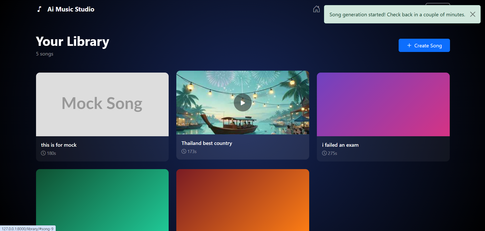
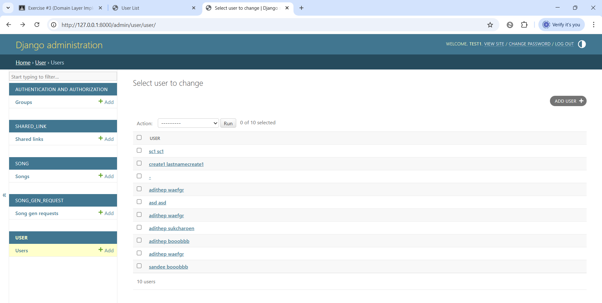
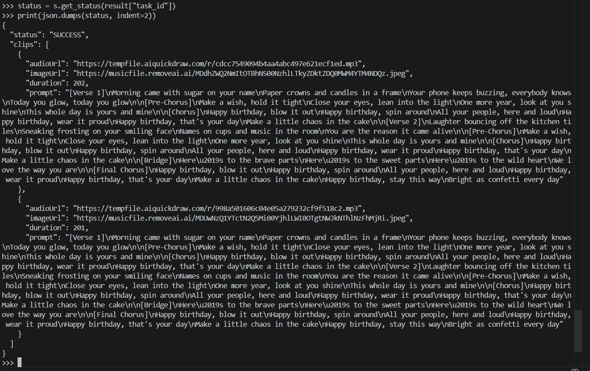

#  Spootify CRUD

## 📌 Prerequisites
Make sure you have the following installed on your machine:

- Python 3.8 or higher  
- pip (Python package installer)

---

## ⚙️ Installation & Setup

### 1. Clone or Download the Repository
Navigate to the project folder in your terminal:

```bash
cd "into folder"
```

### 2. Create a Virtual Environment (Recommended)

```bash
python -m venv venv
```

Activate it:

- **Windows:**
```bash
venv\Scripts\activate
```

- **Mac/Linux:**
```bash
source venv/bin/activate
```

### 3. Install Django

```bash
pip install django
```

### 4. Apply Database Migrations

```bash
python manage.py makemigrations
python manage.py migrate
```

### 5. Run the Development Server

```bash
python manage.py runserver
```

### 6. Access the Application

Open your web browser and go to:  
http://127.0.0.1:8000/

### 7. Option1 crud by django admin
```bash
python manage.py createsuperuser
```
then go to http://127.0.0.1:8000/admin and login
click any folder and you could crud there

---

### 7. Option2 crud by simple views
in landing page there is a dashboard with buttons thats redirect to read and add. update and del buttons is in read page.
```python

path('', TemplateView.as_view(template_name='dashboard.html'), name='home'),

# User CRUD
path('create-user/', create_user, name="create_user"),
path('read-user/', read_user, name="read_user"),
path("update-user/<int:user_id>/", update_user, name="update_user"),
path("delete-user/<int:user_id>/", delete_user, name="delete_user"),

# Song Gen Request CRUD
path('create-song-gen-request/', create_song_gen_request, name="create_song_gen_request"),
path('read-song-gen-request/', read_song_gen_request, name="read_song_gen_request"),
path("update-song-gen-request/<int:request_id>/", update_song_gen_request, name="update_song_gen_request"),
path("delete-song-gen-request/<int:request_id>/", delete_song_gen_request, name="delete_song_gen_request"),

# Song CRUD
path('create-song/', create_song, name="create_song"),
path('read-song/', read_song, name="read_song"),
path("update-song/<int:song_id>/", update_song, name="update_song"),
path("delete-song/<int:song_id>/", delete_song, name="delete_song"),

# Shared Link CRUD
path('create-shared-link/', create_shared_link, name="create_shared_link"),
path('read-shared-link/', read_shared_link, name="read_shared_link"),
path("update-shared-link/<int:link_id>/", update_shared_link, name="update_shared_link"),
path("delete-shared-link/<int:link_id>/", delete_shared_link, name="delete_shared_link")
```
### 8. Screenshots
this is the landing page


this is simple view show

this is when click into view all user button or go to http://127.0.0.1:8000/read-user


when click create button or go to  http://127.0.0.1:8000/create-user

when create success it will show "User created successfully!"

now that user with name testcreate2 appear in id 14

can also see in django admin but you have to create superuser first


so next is update button access on read page
so i will chage from testcreate2 into testupdate2 as in picture below.


now that id 14 testcreate2 turn into testupdate2


next is when click delete button it show warning


i clicked yes and it is gone now.


i also do django admin so
once login django admin can choose topics in side bar and click add user and add directly


can click into any data and update and delete directly too

