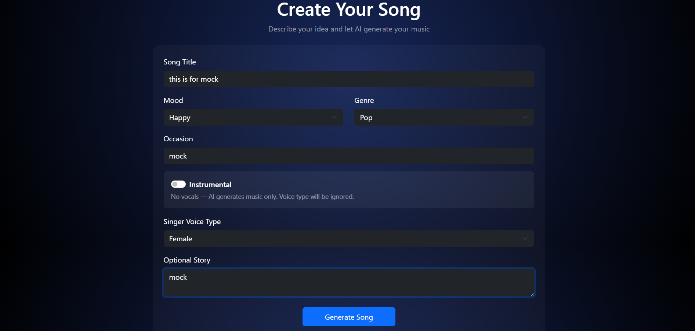
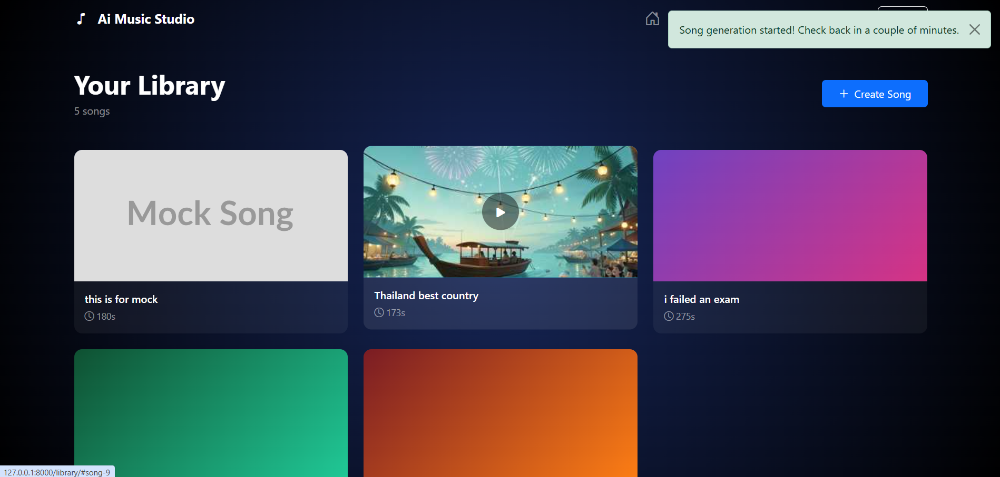
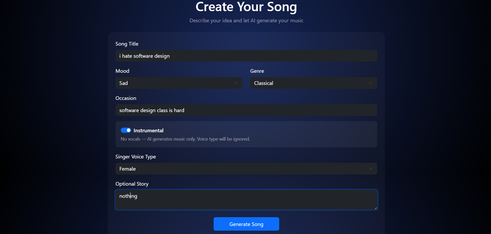
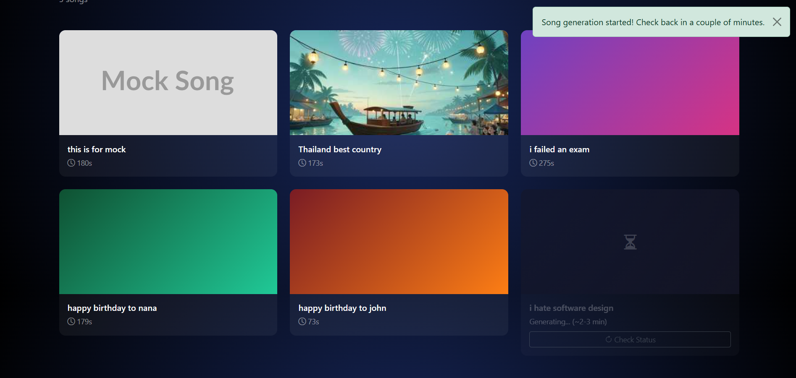
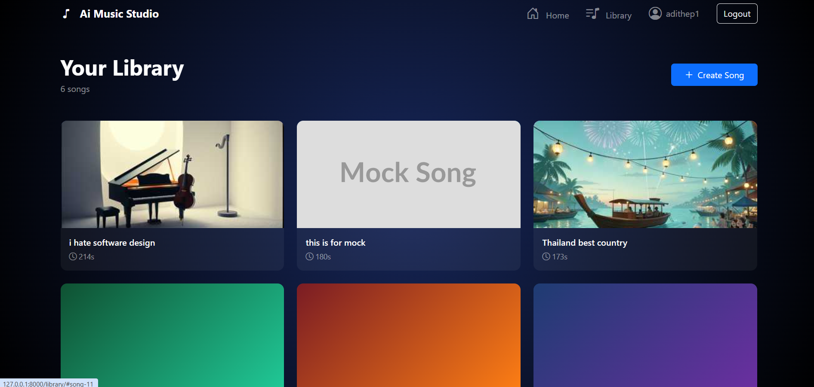
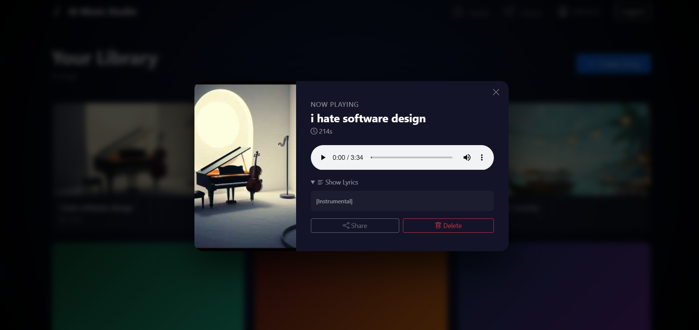
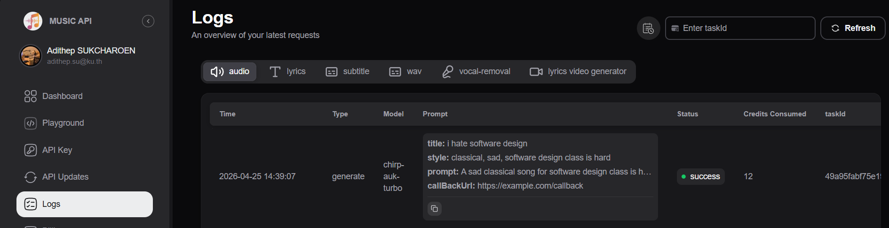

# AI Music Web

A Django web app that lets users generate AI-powered songs using the Suno API. Sign in with Google, describe your song, and get a fully generated track with lyrics and album art saved to your personal library.

---

## Features

- **Google OAuth login** via django-allauth
- **AI song generation** powered by [Suno API](https://sunoapi.org)
- **Custom song settings** — mood, genre, occasion, voice type, and optional story
- **Instrumental toggle** — generate music-only tracks with no vocals
- **Personal library** — song cards with album art, audio player, and collapsible lyrics
- **Pending song tracking** — generating songs show a "Check Status" button; page does not auto-refresh so existing songs keep playing

---

## Tech Stack

- Python 3.13 / Django 6
- Bootstrap 5 + Bootstrap Icons
- SQLite (development database)
- Suno API (external AI music generation)
- django-allauth (Google OAuth)
- Django REST Framework

```bash
cd "into folder"
```

- Python 3.10 or higher
- pip
- A [Suno API](https://sunoapi.org) key
- A Google OAuth client ID and secret (via Google Cloud Console)

---

## Installation & Setup

### 1. Clone the repository

```bash
git clone <repo-url>
cd aimusicweb
```

### 2. Create and activate a virtual environment

```bash
python -m venv venv

# Windows
venv\Scripts\activate

# Mac/Linux
source venv/bin/activate
```

### 3. Install dependencies

```bash
pip install -r requirements.txt
```

### 4. Configure environment variables

Create a `.env` file follwing .env.example

```env
SUNO_API_KEY="your-suno-api-key-here"
GOOGLE_CLIENT_ID="your-google-client-id.apps.googleusercontent.com"
GOOGLE_SECRET="your-google-secret"

# Strategy selection: "mock" for offline testing, "suno" for real API calls
GENERATOR_STRATEGY="suno"
```

### 5. Apply database migrations

```bash
python manage.py migrate
```

### 6. Create an admin superuser

This is required to access Django admin and configure Google OAuth:

```bash
python manage.py createsuperuser
```

### 7. Set up Google OAuth

1. Go to [Google Cloud Console](https://console.cloud.google.com/) and create an OAuth 2.0 client
2. Set the redirect URI to `http://127.0.0.1:8000/accounts/google/login/callback/`
3. Run the server, go to `http://127.0.0.1:8000/admin/` and log in with your superuser account
4. Go to **Sites** → click the existing site → update the domain to `127.0.0.1:8000`
5. Go to **Social applications** → Add → select Google → enter your Client ID and Secret from Google Cloud Console → move the site to "Chosen sites"


### 8. Run the development server

```bash
python manage.py runserver
```

Open `http://127.0.0.1:8000` in your browser.

---

## How It Works

1. Sign in with your Google account
2. Click **Create Song** and fill in the form (mood, genre, occasion, etc.)
3. Submit — the app calls the Suno API and saves a pending request
4. Go to your **Library** and click **Check Status** after ~2-3 minutes
5. Once ready, the song card appears with album art, an audio player, and a lyrics panel

---

## How to run mock
first in env file type
```bash
GENERATOR_STRATEGY="mock"
```
then run server, signin, and go to library page


then click on create song button and eneter anything


click generate



now mock is done. every song the same.

---

## How to run suno
first in env file type
```bash
GENERATOR_STRATEGY="suno"
```
then run server, signin, and go to library page

click create song button


then generate


now the card will appear show that it is generating and can check status.

ok it finished generated. the i hate software design song apprear now


when click inside song card

and logs

